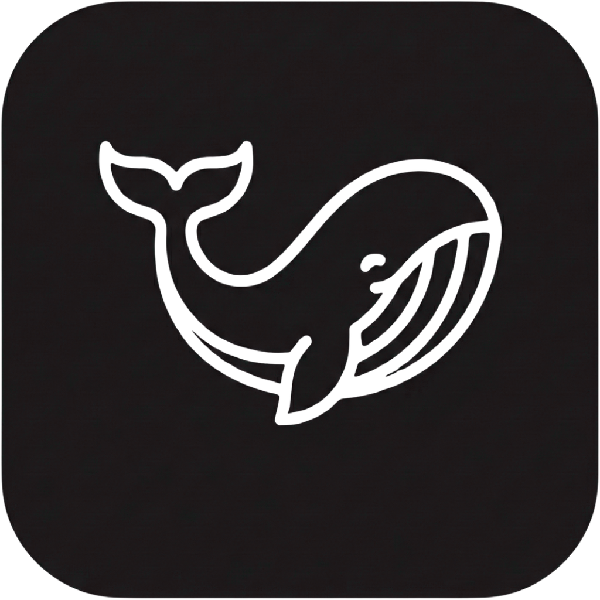

<h1 align="left">Hi, I'm Mauricio Rossetti!</h1>

### Fullstack Developer & DevOps Engineer

Sou estudante de Engenharia de Software (22 anos), focado em criar soluções robustas de ponta a ponta, do desenvolvimento do frontend à infraestrutura automatizada.

- **Frontend:** Especialista em **Angular** (UI/UX, Integrações).
- **Backend:** Foco em **NestJS**, Node.js e .NET.
- **Infra:** Deploy automatizado com **Docker** e **Dokploy**.

  
  

<h1></h1>

**Core Focus:**
 

**Languages & Tools:**
 

<h1></h1>

  
  
  
  

